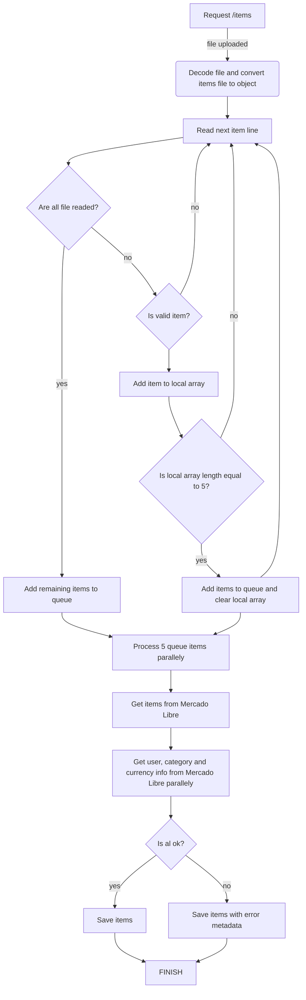

## Meli Items

## Init databases
-  docker-compose up

## Start project
- nest start:dev

## Endpoints

- `/items`

```mermaid
flowchart TD
    A[Request /items] -->|file uploaded| B(Decode file and convert items file to object)
    B --> C[Read next item line]
    C --> E{Are all file readed?}
    E --> |yes| F[Add remaining items to queue]
    E --> |no| G{Is valid item?}
    G --> |no| C
    G --> H[Add item to local array]
    H --> I{Is local array length equal to 5?}
    I --> |no| C
    I --> |yes| J[Add items to queue and clear local array]
    J --> C
    F --> K[Process 5 queue items parallely]
    J --> K
    K --> L[Get items from Mercado Libre]
    L --> M[Get user, category and currency info from Mercado Libre parallely]
    M --> O{Is al ok?}
    O --> |yes| P[Save items]
    O --> |no| Q[Save items with error metadata]
    P --> FINISH
    Q --> FINISH
```
