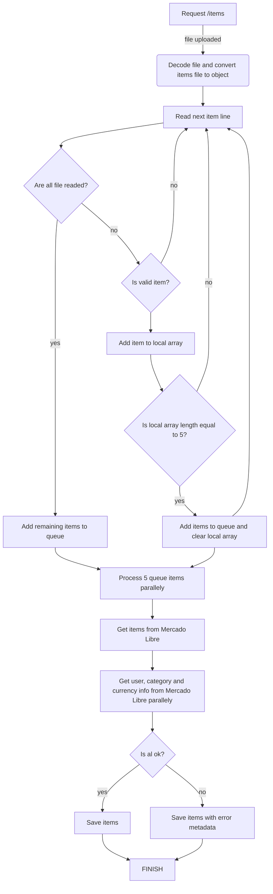

## Meli Items


## Databases

You can find databases connections on .env.example file if you want to see database localy

### Example items on database when FAILED

```
{
  "id": "655915616",
  "site": "MLA",
  "metadata": {
    "error": {
      "message": "Item with id MLA655915616 not found",
      "error": "not_found",
      "status": 404,
      "cause": []
    }
  },
  "status": "FAILED",
  "created_at": {
    "$date": "2023-10-22T05:46:02.588Z"
  }
}
```

### Example item when APPROVED

```
{
  "price": 110716,
  "start_time": "2019-11-04T03:45:50.000Z",
  "name": "Libros Físicos",
  "description": "Peso argentino",
  "nickname": "LIBERATE_ARG",
  "id": "823408605",
  "site": "MLA",
  "status": "APPROVED",
  "created_at": {
    "$date": "2023-10-22T05:46:02.601Z"
  }
}
```

## Start project
- `cd ./docker`
- `docker-compose up`

## Endpoints

- `POST /items`

```
curl --location 'http://localhost:3000/items' \
--form 'file=@"/path/to/file"' \
--form 'separator="\\\\t"' \
--form 'encoding="utf8"' \
--form 'format="tsv"'
```

### Request

```
{
    "file": File,
    "separator": "," OR "." OR "-" OR "_" OR "\t",
    "encoding": "ascii" OR "utf8" OR "utf-8" OR "base64" OR "hex",
    "format": "csv" OR "tsv" OR "jsonl" OR "txt"
}
```

### Response

```
    file.csv received successfully. Uploading items...
```


